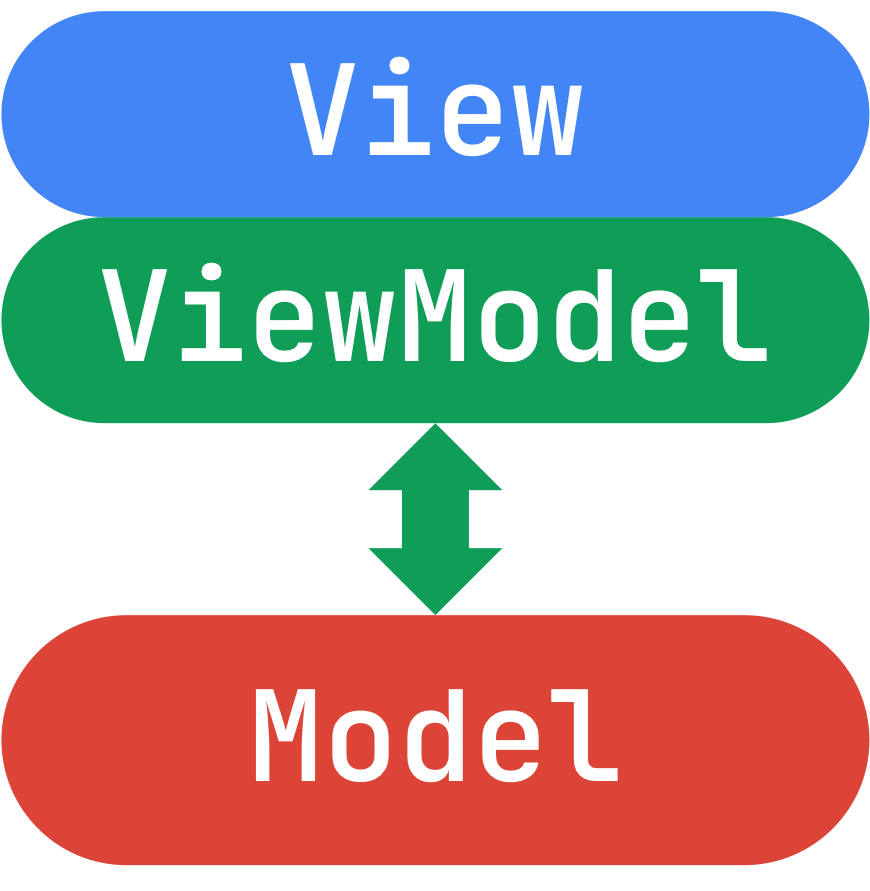

# Design Icons

ダウンロードは[こちら](https://)からどうぞ

| 名前.png                   | 画像                                                          |
| -------------------------- | ------------------------------------------------------------- |
| pkg-red                    |                     |
| pkg-red-dark               |                |
| pkg-green                  |                   |
| pkg-green-dark             |              |
| pkg-blue                   |                    |
| pkg-blue-dark              |               |
| pkg-yellow                 |                  |
| pkg-yellow-dark            |             |
| folder-close-red           |            |
| folder-close-red-dark      |       |
| folder-open-red            |             |
| folder-open-red-dark       |        |
| folder-close-green         |          |
| folder-close-green-dark    |     |
| folder-open-green          |           |
| folder-open-green-dark     |      |
| folder-close-blue          |           |
| folder-close-blue-dark     |      |
| folder-open-blue           |            |
| folder-open-blue-dark      |       |
| folder-close-yellow        |         |
| folder-close-yellow-dark   |    |
| folder-open-yellow         |          |
| folder-open-yellow-dark    |     |
| file                       |                        |
| file-dark                  |                   |
| archit-onion               |                |
| archit-clean               |                |
| archit-mvc                 |                  |
| archit-mvvm                |                 |
| archit-ruby-onion          |          |
| widget-stless              |               |
| widget-stful               |                |
| widget-consumer            |             |
| widget-hook                |                 |
| widget-consumer-stful      |       |
| widget-hook-consumer       |        |
| widget-stful-hook-consumer |  |
| state                      |                       |
| state-and-provider         |          |
| provider                   |                    |
| notifier                   |                    |
| notifier-dollar            |             |
| gen                        |                         |
| ref                        |                         |
| ref-watch                  |                   |
| ref-listen                 |                  |
| ref-read                   |                    |
| async-value                |                 |
| async-value-loading        |         |
| async-value-error          |           |
| async-value-data           |            |
| state-select               |                |
| provider-keep-alive        |         |
| provider-basic             |              |
| provider-proxy             |              |
| provider-logic             |              |
| provider-cache             |              |
| provider-family            |             |
| provider-scope             |              |
| override-with              |               |
